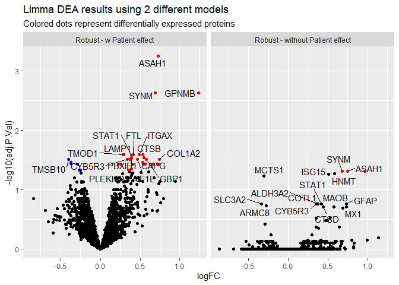
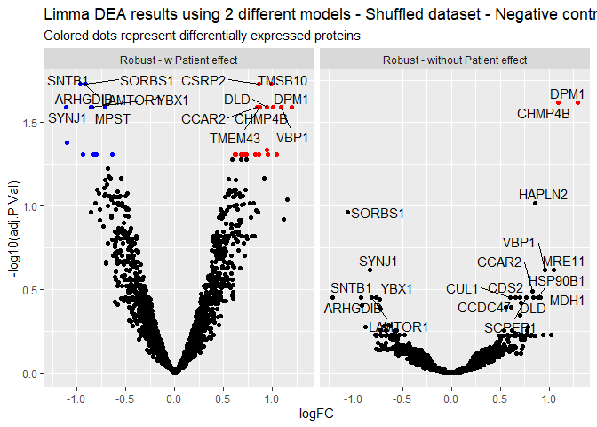

Limma DE analysis - GBM data - Including patient random effect
================
Miguel Cosenza
1/8/2021

#### *Required packages*

``` r
library(tidyverse)
library(ggrepel)
library(limma)
library(kableExtra)
```

# Limma Differential expression analysis of GBM cancer data, including the random effect of patient in the design matrix

The objective of this study is to identify protein signatures associated
with recurrent or primary tumor. In one sentence, we want answer: **What
is the difference in terms of protein expression between recurrent and
primary GBM tumors?**

Glioblastoma tumors are of highly heterogeneous nature. This implies an
important inter-patient variability that make it difficult to test for
differences in tumor tissue without accounting for the patient effect.
Including the random patient effect in the general linear model, applied
by the protein-wise via `limma` analysis, allows for the evaluation of
the the specific effect of the tumor stage.

Samples from 11 patients were obtained at the two different stages
(primary and recurrent). 1 patient (patient 6) was excluded from the
analysis because unsupervised/exploratory analysis pointed it as an
outlier. It was assumed as a sample processing error.

The experimental design was set up in a patient-matched manner, in order
to control for the random effect between patients while exploring the
differences of interest between recurrent and primary tumor.

### Load and format data

We load the data and exclude patient 6. The sample names are defined as
`N.stage`, where `N` is the patient number and `stage` is either
`primary` or `recurrent` tumor. Then transform the expression dataset
into a matrix object in R.

``` r
# Load and format GBM dataset 
exprdata <- read.table("Data/input_limma_nofilter_NOmissing.txt", sep="\t", header=TRUE)
exprdata <- dplyr::select(exprdata, -c(X6.prim, X6.rec)) %>% 
                    na.omit() # remove all proteins with NAs

colnames(exprdata)<- c("Protein",substr(colnames(exprdata[2:length(exprdata)]),2,8))

exprdata <- exprdata[
                    ,c("Protein","1.prim","2.prim","3.prim","4.prim","5.prim","7.prim","8.prim","9.prim","10.prim","11.prim",
                       "1.rec","2.rec","3.rec","4.rec","5.rec","7.rec","8.rec","9.rec","10.rec","11.rec")]

matexpr <- dplyr::select(exprdata,
                         -Protein) 
row.names(matexpr) <- exprdata$Protein

quant.df <- as.matrix(matexpr)
```

## Setting up the design matrix for `limma`

Design matrices are the way to tell R, and this case `limma`, what’s our
experimental design and how to compare the groups we have in our data.

If we look at our data, we have two factors: `patient` and `stage`, from
which we are interested on `stage`. Nevertheless, we should take into
account the effect on the variance due to inter-patient variability. We
do that by setting up the appropriate design matrix.

If we take a look at our samples names from the expression dataset, they
look like this:

``` r
samples <- names(exprdata)[-1]
print(samples)
```

    ##  [1] "1.prim"  "2.prim"  "3.prim"  "4.prim"  "5.prim"  "7.prim"  "8.prim" 
    ##  [8] "9.prim"  "10.prim" "11.prim" "1.rec"   "2.rec"   "3.rec"   "4.rec"  
    ## [15] "5.rec"   "7.rec"   "8.rec"   "9.rec"   "10.rec"  "11.rec"

From that we can extract the information we need to set up the
apropriate design matrix. We use the “.” separator to create our two
factors/variables of interest: `patient` and `tumor`, this last one
reffering to tumor stage.

``` r
split1 <- str_split_fixed(samples, pattern = "\\.", n = 2)

patient <- split1[,1]
tumor <- split1[,2]
```

Checking the `patient` factor, we see a characted vector that assigns a
number to each patient in the study. As observed, the numbers are
repeated twice, because for each patient we have two tumor stages
(`primary` and `recurrent`).

``` r
patient
```

    ##  [1] "1"  "2"  "3"  "4"  "5"  "7"  "8"  "9"  "10" "11" "1"  "2"  "3"  "4"  "5" 
    ## [16] "7"  "8"  "9"  "10" "11"

We can have a similar observation by checking the `tumor` factor. We see
a characted vector that allows to separate the patient samples into
`primary` and `recurrent` tumor.

``` r
tumor
```

    ##  [1] "prim" "prim" "prim" "prim" "prim" "prim" "prim" "prim" "prim" "prim"
    ## [11] "rec"  "rec"  "rec"  "rec"  "rec"  "rec"  "rec"  "rec"  "rec"  "rec"

Then we can create the design matrix that would serve for answering our
biostatistical question, using the `model.matrix()` function and our two
factors of interest as an input.

``` r
design_limma <- model.matrix(~patient+tumor)
```

Just for comparison, let’s create a *simple* design matrix, which would
not include the patient random effect in the model.

``` r
design_tumor <- model.matrix(~tumor)
```

#### Let’s see how the design matrices looks and try to interpret them in the context of our current dataset and biological question

  - **Design matrix with patient random effect**

<!-- end list -->

``` r
design_limma
```

    ##    (Intercept) patient10 patient11 patient2 patient3 patient4 patient5 patient7
    ## 1            1         0         0        0        0        0        0        0
    ## 2            1         0         0        1        0        0        0        0
    ## 3            1         0         0        0        1        0        0        0
    ## 4            1         0         0        0        0        1        0        0
    ## 5            1         0         0        0        0        0        1        0
    ## 6            1         0         0        0        0        0        0        1
    ## 7            1         0         0        0        0        0        0        0
    ## 8            1         0         0        0        0        0        0        0
    ## 9            1         1         0        0        0        0        0        0
    ## 10           1         0         1        0        0        0        0        0
    ## 11           1         0         0        0        0        0        0        0
    ## 12           1         0         0        1        0        0        0        0
    ## 13           1         0         0        0        1        0        0        0
    ## 14           1         0         0        0        0        1        0        0
    ## 15           1         0         0        0        0        0        1        0
    ## 16           1         0         0        0        0        0        0        1
    ## 17           1         0         0        0        0        0        0        0
    ## 18           1         0         0        0        0        0        0        0
    ## 19           1         1         0        0        0        0        0        0
    ## 20           1         0         1        0        0        0        0        0
    ##    patient8 patient9 tumorrec
    ## 1         0        0        0
    ## 2         0        0        0
    ## 3         0        0        0
    ## 4         0        0        0
    ## 5         0        0        0
    ## 6         0        0        0
    ## 7         1        0        0
    ## 8         0        1        0
    ## 9         0        0        0
    ## 10        0        0        0
    ## 11        0        0        1
    ## 12        0        0        1
    ## 13        0        0        1
    ## 14        0        0        1
    ## 15        0        0        1
    ## 16        0        0        1
    ## 17        1        0        1
    ## 18        0        1        1
    ## 19        0        0        1
    ## 20        0        0        1
    ## attr(,"assign")
    ##  [1] 0 1 1 1 1 1 1 1 1 1 2
    ## attr(,"contrasts")
    ## attr(,"contrasts")$patient
    ## [1] "contr.treatment"
    ## 
    ## attr(,"contrasts")$tumor
    ## [1] "contr.treatment"

What we see is a matrix with 20 rows and 11 columns.

Each row corresponds to a sample from our expression dataset. Each
column corresponds to a coefficient, as it would be interpreted when
used as input in the general linear model which is applied by `limma` on
each protein/gene. The matrix is filled with `0`s and `1`s. We should
interpret the presence of a `1` as *switching on* the ‘identity’ of a
sample towards the coefficient on which the `1`is appearing.

For example: checking row 12, we see a `1` on the coefficient `patient2`
and on the coefficient `tumorrec`. This is telling the `limma`-fitted
model: "the **column 12** in the expression dataset, corresponds to
`patient 2` and `recurrent` tumor.

Here, since we included both `stage` and `patient` effects in the
models, we have coefficients for both factors.

Notice that we have 9 coefficients for patients and 1 coefficient for
the type of tumor. This is because the model is set up to work against a
reference level. For `stage` our reference level is `tumorprimary` and
for `patient`, the reference level is `patient1`. We don’t see those in
the matrix because they are represented by the intercept column.

Also notice that the **rows** of your design matrix should exactly
correspond to the **column** names in your original expression matrix
(excluding the column containing the protein names, of course). Checking
this is a good way to see if you are actually comparing what you want to
compare or if the labels were mixed up somehow.

Let us see how the ‘simple’ design matrix looks like (the one that
doesn’t include the `patient` coefficients).

  - **Design matrix without the patient random effect**

<!-- end list -->

``` r
design_tumor
```

    ##    (Intercept) tumorrec
    ## 1            1        0
    ## 2            1        0
    ## 3            1        0
    ## 4            1        0
    ## 5            1        0
    ## 6            1        0
    ## 7            1        0
    ## 8            1        0
    ## 9            1        0
    ## 10           1        0
    ## 11           1        1
    ## 12           1        1
    ## 13           1        1
    ## 14           1        1
    ## 15           1        1
    ## 16           1        1
    ## 17           1        1
    ## 18           1        1
    ## 19           1        1
    ## 20           1        1
    ## attr(,"assign")
    ## [1] 0 1
    ## attr(,"contrasts")
    ## attr(,"contrasts")$tumor
    ## [1] "contr.treatment"

In this case, it is only separating the dataset into `recurrent` vs
`primary`. We will see that, in the context of this study, the detection
of proteomic differences using this simple design is a lot less
sensitive.

## Fitting the generalized linear model using `limma`

Then we can fit the model using the `lmFit` function from `limma`.

Here we will fit the two models with the different design matrices to
illustrate the difference in the results.

### Including the random patient effect (patient-matched/sample-matched design)

We set the method to `robust`, which forces the application of a robust
regression for the linear model. This type of regression is ‘resistant’
to outliers and therefore is very useful when working with heterogeneous
data.

The tabular results are extracted with the `topTable` function and
setting the `coef` argument as the name of the coefficient on which we
are interested to check.

In this case, we want to check differences between `recurrent` and
`primary`, which are evaluated by the `tumorrec` coefficient.

The differences between tumor stages are, at this point, already
corrected for the patient effect.

``` r
fit_matched <- lmFit(quant.df, # expression matrix
                     design = design_limma, # design matrix
                     method = "robust") # set to robust regression  
fit_matched <- eBayes(fit_matched)

fit_matched_tab <- topTable(fit_matched, 
                            coef = "tumorrec", 
                            number = Inf, 
                            adjust.method = "BH") %>% # FDR correction of DE analysis happens here
  mutate(Protein = rownames(.), # include the Protein IDs as a column
         Model = "Robust - w Patient effect") # just adding a column indicating which model was applied.
```

In this case, `fit_matched_tab` is a table with the summarized results
of the differential expression analysis after `limma`, with adjusted and
non-adjusted p-values, proteins and fold-changes.

#### Tabular output of the differentially expressed proteins after Robust `limma` including the random effect by patient in the model.

``` r
kableExtra::kbl(fit_matched_tab %>% filter(adj.P.Val <= 0.05)) %>%
  kableExtra::kable_paper("hover") %>%
  kableExtra::scroll_box(width = "100%", height = "450px")
```

<div style="border: 1px solid #ddd; padding: 0px; overflow-y: scroll; height:450px; overflow-x: scroll; width:100%; ">

<table class=" lightable-paper lightable-hover" style='font-family: "Arial Narrow", arial, helvetica, sans-serif; margin-left: auto; margin-right: auto;'>

<thead>

<tr>

<th style="text-align:right;position: sticky; top:0; background-color: #FFFFFF;">

logFC

</th>

<th style="text-align:right;position: sticky; top:0; background-color: #FFFFFF;">

AveExpr

</th>

<th style="text-align:right;position: sticky; top:0; background-color: #FFFFFF;">

t

</th>

<th style="text-align:right;position: sticky; top:0; background-color: #FFFFFF;">

P.Value

</th>

<th style="text-align:right;position: sticky; top:0; background-color: #FFFFFF;">

adj.P.Val

</th>

<th style="text-align:right;position: sticky; top:0; background-color: #FFFFFF;">

B

</th>

<th style="text-align:left;position: sticky; top:0; background-color: #FFFFFF;">

Protein

</th>

<th style="text-align:left;position: sticky; top:0; background-color: #FFFFFF;">

Model

</th>

</tr>

</thead>

<tbody>

<tr>

<td style="text-align:right;">

0.7275327

</td>

<td style="text-align:right;">

13.11779

</td>

<td style="text-align:right;">

10.425511

</td>

<td style="text-align:right;">

0.0000003

</td>

<td style="text-align:right;">

0.0005687

</td>

<td style="text-align:right;">

6.8783184

</td>

<td style="text-align:left;">

Q13510

</td>

<td style="text-align:left;">

Robust - w Patient effect

</td>

</tr>

<tr>

<td style="text-align:right;">

0.6936556

</td>

<td style="text-align:right;">

12.26935

</td>

<td style="text-align:right;">

8.358686

</td>

<td style="text-align:right;">

0.0000027

</td>

<td style="text-align:right;">

0.0023724

</td>

<td style="text-align:right;">

4.9561910

</td>

<td style="text-align:left;">

O15061

</td>

<td style="text-align:left;">

Robust - w Patient effect

</td>

</tr>

<tr>

<td style="text-align:right;">

1.2364568

</td>

<td style="text-align:right;">

12.89651

</td>

<td style="text-align:right;">

8.182281

</td>

<td style="text-align:right;">

0.0000034

</td>

<td style="text-align:right;">

0.0023724

</td>

<td style="text-align:right;">

4.7592111

</td>

<td style="text-align:left;">

Q14956

</td>

<td style="text-align:left;">

Robust - w Patient effect

</td>

</tr>

<tr>

<td style="text-align:right;">

0.4898348

</td>

<td style="text-align:right;">

12.06928

</td>

<td style="text-align:right;">

6.041366

</td>

<td style="text-align:right;">

0.0000635

</td>

<td style="text-align:right;">

0.0255469

</td>

<td style="text-align:right;">

2.0895317

</td>

<td style="text-align:left;">

P20702

</td>

<td style="text-align:left;">

Robust - w Patient effect

</td>

</tr>

<tr>

<td style="text-align:right;">

0.2838637

</td>

<td style="text-align:right;">

12.31353

</td>

<td style="text-align:right;">

5.948717

</td>

<td style="text-align:right;">

0.0000731

</td>

<td style="text-align:right;">

0.0255469

</td>

<td style="text-align:right;">

1.9543418

</td>

<td style="text-align:left;">

P28289

</td>

<td style="text-align:left;">

Robust - w Patient effect

</td>

</tr>

<tr>

<td style="text-align:right;">

0.4107713

</td>

<td style="text-align:right;">

12.69578

</td>

<td style="text-align:right;">

5.946112

</td>

<td style="text-align:right;">

0.0000733

</td>

<td style="text-align:right;">

0.0255469

</td>

<td style="text-align:right;">

1.9371872

</td>

<td style="text-align:left;">

P02792

</td>

<td style="text-align:left;">

Robust - w Patient effect

</td>

</tr>

<tr>

<td style="text-align:right;">

0.5367449

</td>

<td style="text-align:right;">

12.30817

</td>

<td style="text-align:right;">

5.833451

</td>

<td style="text-align:right;">

0.0000871

</td>

<td style="text-align:right;">

0.0255490

</td>

<td style="text-align:right;">

1.7860000

</td>

<td style="text-align:left;">

P07858

</td>

<td style="text-align:left;">

Robust - w Patient effect

</td>

</tr>

<tr>

<td style="text-align:right;">

0.2904823

</td>

<td style="text-align:right;">

12.77941

</td>

<td style="text-align:right;">

5.758274

</td>

<td style="text-align:right;">

0.0000978

</td>

<td style="text-align:right;">

0.0255490

</td>

<td style="text-align:right;">

1.6748936

</td>

<td style="text-align:left;">

P11279

</td>

<td style="text-align:left;">

Robust - w Patient effect

</td>

</tr>

<tr>

<td style="text-align:right;">

0.3901667

</td>

<td style="text-align:right;">

12.62576

</td>

<td style="text-align:right;">

5.663979

</td>

<td style="text-align:right;">

0.0001132

</td>

<td style="text-align:right;">

0.0262887

</td>

<td style="text-align:right;">

1.5455559

</td>

<td style="text-align:left;">

P42224

</td>

<td style="text-align:left;">

Robust - w Patient effect

</td>

</tr>

<tr>

<td style="text-align:right;">

0.5482843

</td>

<td style="text-align:right;">

12.91454

</td>

<td style="text-align:right;">

5.535293

</td>

<td style="text-align:right;">

0.0001385

</td>

<td style="text-align:right;">

0.0289476

</td>

<td style="text-align:right;">

1.3545852

</td>

<td style="text-align:left;">

P40121

</td>

<td style="text-align:left;">

Robust - w Patient effect

</td>

</tr>

<tr>

<td style="text-align:right;">

0.3916722

</td>

<td style="text-align:right;">

12.64690

</td>

<td style="text-align:right;">

5.464784

</td>

<td style="text-align:right;">

0.0001548

</td>

<td style="text-align:right;">

0.0294204

</td>

<td style="text-align:right;">

1.2496591

</td>

<td style="text-align:left;">

Q8TD55

</td>

<td style="text-align:left;">

Robust - w Patient effect

</td>

</tr>

<tr>

<td style="text-align:right;">

0.5774721

</td>

<td style="text-align:right;">

12.83088

</td>

<td style="text-align:right;">

5.305043

</td>

<td style="text-align:right;">

0.0001999

</td>

<td style="text-align:right;">

0.0306956

</td>

<td style="text-align:right;">

1.0050891

</td>

<td style="text-align:left;">

P32455

</td>

<td style="text-align:left;">

Robust - w Patient effect

</td>

</tr>

<tr>

<td style="text-align:right;">

0.3653500

</td>

<td style="text-align:right;">

12.43873

</td>

<td style="text-align:right;">

5.296931

</td>

<td style="text-align:right;">

0.0002025

</td>

<td style="text-align:right;">

0.0306956

</td>

<td style="text-align:right;">

0.9959927

</td>

<td style="text-align:left;">

Q96AQ6

</td>

<td style="text-align:left;">

Robust - w Patient effect

</td>

</tr>

<tr>

<td style="text-align:right;">

\-0.3983064

</td>

<td style="text-align:right;">

12.93535

</td>

<td style="text-align:right;">

\-5.241693

</td>

<td style="text-align:right;">

0.0002214

</td>

<td style="text-align:right;">

0.0306956

</td>

<td style="text-align:right;">

0.9150505

</td>

<td style="text-align:left;">

P63313

</td>

<td style="text-align:left;">

Robust - w Patient effect

</td>

</tr>

<tr>

<td style="text-align:right;">

0.7418362

</td>

<td style="text-align:right;">

11.95578

</td>

<td style="text-align:right;">

5.209201

</td>

<td style="text-align:right;">

0.0002333

</td>

<td style="text-align:right;">

0.0306956

</td>

<td style="text-align:right;">

0.8599126

</td>

<td style="text-align:left;">

P08123

</td>

<td style="text-align:left;">

Robust - w Patient effect

</td>

</tr>

<tr>

<td style="text-align:right;">

0.4634731

</td>

<td style="text-align:right;">

13.08746

</td>

<td style="text-align:right;">

5.200005

</td>

<td style="text-align:right;">

0.0002368

</td>

<td style="text-align:right;">

0.0306956

</td>

<td style="text-align:right;">

0.8478461

</td>

<td style="text-align:left;">

Q9BQI0

</td>

<td style="text-align:left;">

Robust - w Patient effect

</td>

</tr>

<tr>

<td style="text-align:right;">

0.3364665

</td>

<td style="text-align:right;">

12.49543

</td>

<td style="text-align:right;">

5.167568

</td>

<td style="text-align:right;">

0.0002497

</td>

<td style="text-align:right;">

0.0306956

</td>

<td style="text-align:right;">

0.7920337

</td>

<td style="text-align:left;">

P00387

</td>

<td style="text-align:left;">

Robust - w Patient effect

</td>

</tr>

<tr>

<td style="text-align:right;">

\-0.3722631

</td>

<td style="text-align:right;">

12.43775

</td>

<td style="text-align:right;">

\-5.051459

</td>

<td style="text-align:right;">

0.0003019

</td>

<td style="text-align:right;">

0.0350567

</td>

<td style="text-align:right;">

0.6207018

</td>

<td style="text-align:left;">

Q13423

</td>

<td style="text-align:left;">

Robust - w Patient effect

</td>

</tr>

<tr>

<td style="text-align:right;">

0.5364045

</td>

<td style="text-align:right;">

13.44666

</td>

<td style="text-align:right;">

5.017191

</td>

<td style="text-align:right;">

0.0003195

</td>

<td style="text-align:right;">

0.0351399

</td>

<td style="text-align:right;">

0.5624332

</td>

<td style="text-align:left;">

P09382

</td>

<td style="text-align:left;">

Robust - w Patient effect

</td>

</tr>

<tr>

<td style="text-align:right;">

\-0.3689542

</td>

<td style="text-align:right;">

13.60222

</td>

<td style="text-align:right;">

\-4.967388

</td>

<td style="text-align:right;">

0.0003469

</td>

<td style="text-align:right;">

0.0362471

</td>

<td style="text-align:right;">

0.4779265

</td>

<td style="text-align:left;">

P09669

</td>

<td style="text-align:left;">

Robust - w Patient effect

</td>

</tr>

<tr>

<td style="text-align:right;">

0.2299800

</td>

<td style="text-align:right;">

12.84522

</td>

<td style="text-align:right;">

4.884883

</td>

<td style="text-align:right;">

0.0003978

</td>

<td style="text-align:right;">

0.0376931

</td>

<td style="text-align:right;">

0.3500111

</td>

<td style="text-align:left;">

Q9Y371

</td>

<td style="text-align:left;">

Robust - w Patient effect

</td>

</tr>

<tr>

<td style="text-align:right;">

0.2568687

</td>

<td style="text-align:right;">

12.52452

</td>

<td style="text-align:right;">

4.840666

</td>

<td style="text-align:right;">

0.0004283

</td>

<td style="text-align:right;">

0.0376931

</td>

<td style="text-align:right;">

0.2762176

</td>

<td style="text-align:left;">

Q99536

</td>

<td style="text-align:left;">

Robust - w Patient effect

</td>

</tr>

<tr>

<td style="text-align:right;">

0.5407573

</td>

<td style="text-align:right;">

13.03161

</td>

<td style="text-align:right;">

4.817414

</td>

<td style="text-align:right;">

0.0004454

</td>

<td style="text-align:right;">

0.0376931

</td>

<td style="text-align:right;">

0.2382111

</td>

<td style="text-align:left;">

P05161

</td>

<td style="text-align:left;">

Robust - w Patient effect

</td>

</tr>

<tr>

<td style="text-align:right;">

0.7353163

</td>

<td style="text-align:right;">

12.85567

</td>

<td style="text-align:right;">

4.813133

</td>

<td style="text-align:right;">

0.0004486

</td>

<td style="text-align:right;">

0.0376931

</td>

<td style="text-align:right;">

0.2331094

</td>

<td style="text-align:left;">

P15259

</td>

<td style="text-align:left;">

Robust - w Patient effect

</td>

</tr>

<tr>

<td style="text-align:right;">

\-0.2874492

</td>

<td style="text-align:right;">

12.78695

</td>

<td style="text-align:right;">

\-4.790831

</td>

<td style="text-align:right;">

0.0004657

</td>

<td style="text-align:right;">

0.0376931

</td>

<td style="text-align:right;">

0.1927816

</td>

<td style="text-align:left;">

Q9ULC4

</td>

<td style="text-align:left;">

Robust - w Patient effect

</td>

</tr>

<tr>

<td style="text-align:right;">

0.6592102

</td>

<td style="text-align:right;">

12.63175

</td>

<td style="text-align:right;">

4.733153

</td>

<td style="text-align:right;">

0.0005132

</td>

<td style="text-align:right;">

0.0376931

</td>

<td style="text-align:right;">

0.1154900

</td>

<td style="text-align:left;">

Q9BXX0

</td>

<td style="text-align:left;">

Robust - w Patient effect

</td>

</tr>

<tr>

<td style="text-align:right;">

0.7201211

</td>

<td style="text-align:right;">

12.89716

</td>

<td style="text-align:right;">

4.730122

</td>

<td style="text-align:right;">

0.0005158

</td>

<td style="text-align:right;">

0.0376931

</td>

<td style="text-align:right;">

0.1022762

</td>

<td style="text-align:left;">

P02452

</td>

<td style="text-align:left;">

Robust - w Patient effect

</td>

</tr>

<tr>

<td style="text-align:right;">

0.6698715

</td>

<td style="text-align:right;">

12.66451

</td>

<td style="text-align:right;">

4.718265

</td>

<td style="text-align:right;">

0.0005263

</td>

<td style="text-align:right;">

0.0376931

</td>

<td style="text-align:right;">

0.0890071

</td>

<td style="text-align:left;">

P07602

</td>

<td style="text-align:left;">

Robust - w Patient effect

</td>

</tr>

<tr>

<td style="text-align:right;">

0.5634103

</td>

<td style="text-align:right;">

12.67701

</td>

<td style="text-align:right;">

4.706789

</td>

<td style="text-align:right;">

0.0005366

</td>

<td style="text-align:right;">

0.0376931

</td>

<td style="text-align:right;">

0.0668601

</td>

<td style="text-align:left;">

P01903

</td>

<td style="text-align:left;">

Robust - w Patient effect

</td>

</tr>

<tr>

<td style="text-align:right;">

0.4054453

</td>

<td style="text-align:right;">

12.80919

</td>

<td style="text-align:right;">

4.692531

</td>

<td style="text-align:right;">

0.0005497

</td>

<td style="text-align:right;">

0.0376931

</td>

<td style="text-align:right;">

0.0305885

</td>

<td style="text-align:left;">

P07339

</td>

<td style="text-align:left;">

Robust - w Patient effect

</td>

</tr>

<tr>

<td style="text-align:right;">

0.2548739

</td>

<td style="text-align:right;">

12.57124

</td>

<td style="text-align:right;">

4.682517

</td>

<td style="text-align:right;">

0.0005591

</td>

<td style="text-align:right;">

0.0376931

</td>

<td style="text-align:right;">

0.0246868

</td>

<td style="text-align:left;">

P07099

</td>

<td style="text-align:left;">

Robust - w Patient effect

</td>

</tr>

<tr>

<td style="text-align:right;">

0.3910438

</td>

<td style="text-align:right;">

12.68286

</td>

<td style="text-align:right;">

4.559910

</td>

<td style="text-align:right;">

0.0006889

</td>

<td style="text-align:right;">

0.0449950

</td>

<td style="text-align:right;">

\-0.1723755

</td>

<td style="text-align:left;">

P55008

</td>

<td style="text-align:left;">

Robust - w Patient effect

</td>

</tr>

<tr>

<td style="text-align:right;">

0.3503782

</td>

<td style="text-align:right;">

12.80301

</td>

<td style="text-align:right;">

4.498778

</td>

<td style="text-align:right;">

0.0007651

</td>

<td style="text-align:right;">

0.0475191

</td>

<td style="text-align:right;">

\-0.2881919

</td>

<td style="text-align:left;">

P51648

</td>

<td style="text-align:left;">

Robust - w Patient effect

</td>

</tr>

<tr>

<td style="text-align:right;">

\-0.2526426

</td>

<td style="text-align:right;">

12.40559

</td>

<td style="text-align:right;">

\-4.476330

</td>

<td style="text-align:right;">

0.0007952

</td>

<td style="text-align:right;">

0.0475191

</td>

<td style="text-align:right;">

\-0.2989738

</td>

<td style="text-align:left;">

Q92974

</td>

<td style="text-align:left;">

Robust - w Patient effect

</td>

</tr>

<tr>

<td style="text-align:right;">

\-0.2668870

</td>

<td style="text-align:right;">

12.85706

</td>

<td style="text-align:right;">

\-4.475915

</td>

<td style="text-align:right;">

0.0007958

</td>

<td style="text-align:right;">

0.0475191

</td>

<td style="text-align:right;">

\-0.3023667

</td>

<td style="text-align:left;">

O75955

</td>

<td style="text-align:left;">

Robust - w Patient effect

</td>

</tr>

</tbody>

</table>

</div>

### Without including the random patient effect (‘simple’ design)

Let’s see what happens when we don’t include the patient random effect
in the model. We repeat the same procedure as above, but changing the
design matrix.

``` r
fit_simple <- lmFit(quant.df, # expression matrix
                     design = design_tumor, # design matrix
                     method = "robust") # set to robust regression  
fit_simple <- eBayes(fit_simple)

fit_simple_tab <- topTable(fit_simple, 
                            coef = "tumorrec", 
                            number = Inf, 
                            adjust.method = "BH") %>% # FDR correction of DE analysis happens here
  mutate(Protein = rownames(.), # include the Protein IDs as a column
         Model = "Robust - without Patient effect") # just adding a column indicating which model was applied.
```

#### Tabular output of the differentially expressed proteins after Robust `limma` including the random effect by patient in the model.

``` r
kableExtra::kbl(fit_simple_tab %>% filter(adj.P.Val <= 0.05)) %>%
  kableExtra::kable_paper("hover") %>%
  kableExtra::scroll_box(width = "100%", height = "250px")
```

<div style="border: 1px solid #ddd; padding: 0px; overflow-y: scroll; height:250px; overflow-x: scroll; width:100%; ">

<table class=" lightable-paper lightable-hover" style='font-family: "Arial Narrow", arial, helvetica, sans-serif; margin-left: auto; margin-right: auto;'>

<thead>

<tr>

<th style="text-align:right;position: sticky; top:0; background-color: #FFFFFF;">

logFC

</th>

<th style="text-align:right;position: sticky; top:0; background-color: #FFFFFF;">

AveExpr

</th>

<th style="text-align:right;position: sticky; top:0; background-color: #FFFFFF;">

t

</th>

<th style="text-align:right;position: sticky; top:0; background-color: #FFFFFF;">

P.Value

</th>

<th style="text-align:right;position: sticky; top:0; background-color: #FFFFFF;">

adj.P.Val

</th>

<th style="text-align:right;position: sticky; top:0; background-color: #FFFFFF;">

B

</th>

<th style="text-align:left;position: sticky; top:0; background-color: #FFFFFF;">

Protein

</th>

<th style="text-align:left;position: sticky; top:0; background-color: #FFFFFF;">

Model

</th>

</tr>

</thead>

<tbody>

<tr>

<td style="text-align:right;">

0.7456345

</td>

<td style="text-align:right;">

13.11779

</td>

<td style="text-align:right;">

5.033581

</td>

<td style="text-align:right;">

5.85e-05

</td>

<td style="text-align:right;">

0.0496318

</td>

<td style="text-align:right;">

1.808614

</td>

<td style="text-align:left;">

Q13510

</td>

<td style="text-align:left;">

Robust - without Patient effect

</td>

</tr>

<tr>

<td style="text-align:right;">

0.9676479

</td>

<td style="text-align:right;">

12.69087

</td>

<td style="text-align:right;">

5.051076

</td>

<td style="text-align:right;">

5.61e-05

</td>

<td style="text-align:right;">

0.0496318

</td>

<td style="text-align:right;">

1.744368

</td>

<td style="text-align:left;">

Q13938

</td>

<td style="text-align:left;">

Robust - without Patient effect

</td>

</tr>

<tr>

<td style="text-align:right;">

0.6848143

</td>

<td style="text-align:right;">

12.26935

</td>

<td style="text-align:right;">

4.949017

</td>

<td style="text-align:right;">

7.12e-05

</td>

<td style="text-align:right;">

0.0496318

</td>

<td style="text-align:right;">

1.640867

</td>

<td style="text-align:left;">

O15061

</td>

<td style="text-align:left;">

Robust - without Patient effect

</td>

</tr>

</tbody>

</table>

</div>

### Volcano plots of the DE analyses with the different design matrices

``` r
both_outputs <- bind_rows(fit_matched_tab, fit_simple_tab) # bind limma tabular outputs  

unip2symbol <- clusterProfiler::bitr(both_outputs$Protein,fromType = "UNIPROT", toType = "SYMBOL",
                                     OrgDb = "org.Hs.eg.db", drop = FALSE) %>% 
                    dplyr::rename(Protein = UNIPROT)

both_outputs <- left_join(both_outputs, unip2symbol, by = "Protein")


volcano_plots <- function(limma_out){ # create a function to plot the volcano plots and facet by model
  limma_volc1 <- ggplot(data = limma_out, mapping = aes(x = logFC, y = -log10(adj.P.Val), label = SYMBOL)) +
  geom_point()+
  geom_point(data = filter(limma_out, logFC > 0, adj.P.Val <= 0.05), mapping = aes(x = logFC, y = -log10(adj.P.Val)),
             color = "red")+
  geom_point(data = filter(limma_out, logFC < 0, adj.P.Val <= 0.05), mapping = aes(x = logFC, y = -log10(adj.P.Val)),
             color = "blue")+
  ggrepel::geom_text_repel(data = group_by(limma_out, Model) %>% slice_max(-adj.P.Val, n = 15),
                           aes(label = SYMBOL)) + 
  facet_wrap(.~ Model)
  
  return(limma_volc1)
}

limma_volc1 <- volcano_plots(both_outputs) + ggtitle("Limma DEA results using 2 different models",
                                                   subtitle = "Colored dots represent differentially expressed proteins")
```

``` r
limma_volc1
```

<!-- -->

The model including the patient random effect is a lot more sensitive.

## Negative control of the models using a randomized dataset

A randomized expression matrix was created from the original dataset by
randomly sampling values from both rows and columns, creating a
’shuffled expression matrix, with the same rows and column names, but
randomized values for both rows and columns.

``` r
shuffle_matrix <- function(mat, seed){ # function for shuffling expression values

  set.seed(seed = seed)
  for (i in 1:nrow(mat)){ # shuffle row-wise
  mat[i,] <- sample(mat[i,], size = ncol(mat), replace = FALSE)
  }
  
  for (i in 1:ncol(mat)){ # shuffle column-wise
    mat[,i] <- sample(mat[,i], size = nrow(mat), replace = FALSE)
  }
  
  return(mat)
}

shuffled_exprmat <- shuffle_matrix(quant.df, seed = 2007) 
```

#### **Original expression matrix**

``` r
print(quant.df[1:6, 1:8])
```

    ##              1.prim   2.prim   3.prim    4.prim   5.prim   7.prim   8.prim
    ## A0A024RBG1 11.99555 12.46762 11.88391 12.114982 11.81784 12.07297 11.83033
    ## A0A075B6H9 11.94424  9.80284 11.46883  9.868644 11.23921 10.30292 10.62626
    ## A0A087WW87 13.01257 12.56361 14.84125 12.335733 13.50042 12.51389 12.19128
    ## A0A0A0MRZ8 12.70884 10.33990 12.55996 11.121672 11.69805 11.11931 10.89622
    ## A0A0B4J1U7 13.37967 11.18873 13.70576 12.126204 12.62173 12.57496 12.37310
    ## A0A0C4DH34 14.34520 11.18659 14.29767 11.854798 13.07728 12.49519 12.35282
    ##              9.prim
    ## A0A024RBG1 12.25729
    ## A0A075B6H9 10.00505
    ## A0A087WW87 12.39858
    ## A0A0A0MRZ8 11.20621
    ## A0A0B4J1U7 12.20813
    ## A0A0C4DH34 12.51048

#### **‘Shuffled’ expression matrix**

``` r
print(shuffled_exprmat[1:6, 1:8])
```

    ##              1.prim   2.prim   3.prim   4.prim   5.prim   7.prim   8.prim
    ## A0A024RBG1 12.95979 13.72735 12.72358 11.54038 13.06367 10.84145 12.72057
    ## A0A075B6H9 12.40519 13.11863 13.63059 13.10846 13.35571 12.25546 13.18739
    ## A0A087WW87 12.80899 10.38687 12.70941 12.81201 12.55187 13.05657 14.27597
    ## A0A0A0MRZ8 12.42325 11.61388 10.54593 12.86910 12.84856 13.36397 12.47971
    ## A0A0B4J1U7 12.57766 12.27453 12.46713 12.87533 12.66248 12.05120 11.90167
    ## A0A0C4DH34 11.95037 12.29183 11.96842 12.41054 13.16753 12.58433 12.47795
    ##              9.prim
    ## A0A024RBG1 11.97108
    ## A0A075B6H9 11.76285
    ## A0A087WW87 13.28556
    ## A0A0A0MRZ8 13.55184
    ## A0A0B4J1U7 12.63770
    ## A0A0C4DH34 13.23203

### Fit the linear models with both design matrices

#### With patient matched design

``` r
fit_shmatched <- lmFit(shuffled_exprmat, # expression matrix
                     design = design_limma, # design matrix
                     method = "robust") # set to robust regression  
fit_shmatched <- eBayes(fit_shmatched)

fit_shmatched_tab <- topTable(fit_shmatched, 
                            coef = "tumorrec", 
                            number = Inf, 
                            adjust.method = "BH") %>% # FDR correction of DE analysis happens here
  mutate(Protein = rownames(.), # include the Protein IDs as a column
         Model = "Robust - w Patient effect") # just adding a column indicating which model was applied.
```

##### Tabular output

``` r
kableExtra::kbl(fit_shmatched_tab %>% filter(adj.P.Val <= 0.05)) %>%
  kableExtra::kable_paper("hover") %>%
  kableExtra::scroll_box(width = "100%", height = "450px")
```

<div style="border: 1px solid #ddd; padding: 0px; overflow-y: scroll; height:450px; overflow-x: scroll; width:100%; ">

<table class=" lightable-paper lightable-hover" style='font-family: "Arial Narrow", arial, helvetica, sans-serif; margin-left: auto; margin-right: auto;'>

<thead>

<tr>

<th style="text-align:right;position: sticky; top:0; background-color: #FFFFFF;">

logFC

</th>

<th style="text-align:right;position: sticky; top:0; background-color: #FFFFFF;">

AveExpr

</th>

<th style="text-align:right;position: sticky; top:0; background-color: #FFFFFF;">

t

</th>

<th style="text-align:right;position: sticky; top:0; background-color: #FFFFFF;">

P.Value

</th>

<th style="text-align:right;position: sticky; top:0; background-color: #FFFFFF;">

adj.P.Val

</th>

<th style="text-align:right;position: sticky; top:0; background-color: #FFFFFF;">

B

</th>

<th style="text-align:left;position: sticky; top:0; background-color: #FFFFFF;">

Protein

</th>

<th style="text-align:left;position: sticky; top:0; background-color: #FFFFFF;">

Model

</th>

</tr>

</thead>

<tbody>

<tr>

<td style="text-align:right;">

0.9856527

</td>

<td style="text-align:right;">

12.78461

</td>

<td style="text-align:right;">

6.085753

</td>

<td style="text-align:right;">

0.0000173

</td>

<td style="text-align:right;">

0.0187783

</td>

<td style="text-align:right;">

3.1197942

</td>

<td style="text-align:left;">

P63313

</td>

<td style="text-align:left;">

Robust - w Patient effect

</td>

</tr>

<tr>

<td style="text-align:right;">

\-0.9691769

</td>

<td style="text-align:right;">

12.76595

</td>

<td style="text-align:right;">

\-5.621916

</td>

<td style="text-align:right;">

0.0000414

</td>

<td style="text-align:right;">

0.0187783

</td>

<td style="text-align:right;">

2.3399971

</td>

<td style="text-align:left;">

Q13884

</td>

<td style="text-align:left;">

Robust - w Patient effect

</td>

</tr>

<tr>

<td style="text-align:right;">

\-0.9139116

</td>

<td style="text-align:right;">

12.73014

</td>

<td style="text-align:right;">

\-5.594011

</td>

<td style="text-align:right;">

0.0000437

</td>

<td style="text-align:right;">

0.0187783

</td>

<td style="text-align:right;">

2.2911585

</td>

<td style="text-align:left;">

Q9BX66

</td>

<td style="text-align:left;">

Robust - w Patient effect

</td>

</tr>

<tr>

<td style="text-align:right;">

0.8609531

</td>

<td style="text-align:right;">

12.70629

</td>

<td style="text-align:right;">

5.627104

</td>

<td style="text-align:right;">

0.0000410

</td>

<td style="text-align:right;">

0.0187783

</td>

<td style="text-align:right;">

2.2608477

</td>

<td style="text-align:left;">

Q16527

</td>

<td style="text-align:left;">

Robust - w Patient effect

</td>

</tr>

<tr>

<td style="text-align:right;">

\-0.9220284

</td>

<td style="text-align:right;">

12.61632

</td>

<td style="text-align:right;">

\-5.579325

</td>

<td style="text-align:right;">

0.0000449

</td>

<td style="text-align:right;">

0.0187783

</td>

<td style="text-align:right;">

2.2523919

</td>

<td style="text-align:left;">

Q6IAA8

</td>

<td style="text-align:left;">

Robust - w Patient effect

</td>

</tr>

<tr>

<td style="text-align:right;">

1.1915202

</td>

<td style="text-align:right;">

12.52372

</td>

<td style="text-align:right;">

5.190710

</td>

<td style="text-align:right;">

0.0000956

</td>

<td style="text-align:right;">

0.0258752

</td>

<td style="text-align:right;">

1.5658094

</td>

<td style="text-align:left;">

O60762

</td>

<td style="text-align:left;">

Robust - w Patient effect

</td>

</tr>

<tr>

<td style="text-align:right;">

1.0089616

</td>

<td style="text-align:right;">

12.62791

</td>

<td style="text-align:right;">

5.176669

</td>

<td style="text-align:right;">

0.0000983

</td>

<td style="text-align:right;">

0.0258752

</td>

<td style="text-align:right;">

1.5499949

</td>

<td style="text-align:left;">

Q9H444

</td>

<td style="text-align:left;">

Robust - w Patient effect

</td>

</tr>

<tr>

<td style="text-align:right;">

1.0858799

</td>

<td style="text-align:right;">

12.61374

</td>

<td style="text-align:right;">

5.119022

</td>

<td style="text-align:right;">

0.0001101

</td>

<td style="text-align:right;">

0.0258752

</td>

<td style="text-align:right;">

1.4412270

</td>

<td style="text-align:left;">

P61758

</td>

<td style="text-align:left;">

Robust - w Patient effect

</td>

</tr>

<tr>

<td style="text-align:right;">

0.9413571

</td>

<td style="text-align:right;">

12.76938

</td>

<td style="text-align:right;">

5.039707

</td>

<td style="text-align:right;">

0.0001288

</td>

<td style="text-align:right;">

0.0258752

</td>

<td style="text-align:right;">

1.2984926

</td>

<td style="text-align:left;">

P09622

</td>

<td style="text-align:left;">

Robust - w Patient effect

</td>

</tr>

<tr>

<td style="text-align:right;">

0.8656613

</td>

<td style="text-align:right;">

12.66712

</td>

<td style="text-align:right;">

4.960929

</td>

<td style="text-align:right;">

0.0001507

</td>

<td style="text-align:right;">

0.0258752

</td>

<td style="text-align:right;">

1.1547991

</td>

<td style="text-align:left;">

Q9BTV4

</td>

<td style="text-align:left;">

Robust - w Patient effect

</td>

</tr>

<tr>

<td style="text-align:right;">

\-1.1132860

</td>

<td style="text-align:right;">

12.58771

</td>

<td style="text-align:right;">

\-4.953953

</td>

<td style="text-align:right;">

0.0001528

</td>

<td style="text-align:right;">

0.0258752

</td>

<td style="text-align:right;">

1.1421782

</td>

<td style="text-align:left;">

P52566

</td>

<td style="text-align:left;">

Robust - w Patient effect

</td>

</tr>

<tr>

<td style="text-align:right;">

\-0.8548596

</td>

<td style="text-align:right;">

12.24106

</td>

<td style="text-align:right;">

\-4.889203

</td>

<td style="text-align:right;">

0.0001740

</td>

<td style="text-align:right;">

0.0258752

</td>

<td style="text-align:right;">

1.0199417

</td>

<td style="text-align:left;">

O43426

</td>

<td style="text-align:left;">

Robust - w Patient effect

</td>

</tr>

<tr>

<td style="text-align:right;">

\-0.7145070

</td>

<td style="text-align:right;">

12.51154

</td>

<td style="text-align:right;">

\-4.875971

</td>

<td style="text-align:right;">

0.0001786

</td>

<td style="text-align:right;">

0.0258752

</td>

<td style="text-align:right;">

0.9960402

</td>

<td style="text-align:left;">

P25325

</td>

<td style="text-align:left;">

Robust - w Patient effect

</td>

</tr>

<tr>

<td style="text-align:right;">

0.8447089

</td>

<td style="text-align:right;">

12.56219

</td>

<td style="text-align:right;">

4.868590

</td>

<td style="text-align:right;">

0.0001813

</td>

<td style="text-align:right;">

0.0258752

</td>

<td style="text-align:right;">

0.9825639

</td>

<td style="text-align:left;">

Q8N163

</td>

<td style="text-align:left;">

Robust - w Patient effect

</td>

</tr>

<tr>

<td style="text-align:right;">

\-0.8520065

</td>

<td style="text-align:right;">

12.50058

</td>

<td style="text-align:right;">

\-4.856593

</td>

<td style="text-align:right;">

0.0001857

</td>

<td style="text-align:right;">

0.0258752

</td>

<td style="text-align:right;">

0.9619961

</td>

<td style="text-align:left;">

P67809

</td>

<td style="text-align:left;">

Robust - w Patient effect

</td>

</tr>

<tr>

<td style="text-align:right;">

\-1.1049395

</td>

<td style="text-align:right;">

12.19286

</td>

<td style="text-align:right;">

\-4.586466

</td>

<td style="text-align:right;">

0.0003206

</td>

<td style="text-align:right;">

0.0418736

</td>

<td style="text-align:right;">

0.4585847

</td>

<td style="text-align:left;">

P00492

</td>

<td style="text-align:left;">

Robust - w Patient effect

</td>

</tr>

<tr>

<td style="text-align:right;">

0.9435772

</td>

<td style="text-align:right;">

12.82053

</td>

<td style="text-align:right;">

4.504354

</td>

<td style="text-align:right;">

0.0003790

</td>

<td style="text-align:right;">

0.0465917

</td>

<td style="text-align:right;">

0.2987905

</td>

<td style="text-align:left;">

Q15155

</td>

<td style="text-align:left;">

Robust - w Patient effect

</td>

</tr>

<tr>

<td style="text-align:right;">

0.7301811

</td>

<td style="text-align:right;">

12.70549

</td>

<td style="text-align:right;">

4.417681

</td>

<td style="text-align:right;">

0.0004525

</td>

<td style="text-align:right;">

0.0490188

</td>

<td style="text-align:right;">

0.1337603

</td>

<td style="text-align:left;">

Q9GZV7

</td>

<td style="text-align:left;">

Robust - w Patient effect

</td>

</tr>

<tr>

<td style="text-align:right;">

0.6232353

</td>

<td style="text-align:right;">

12.40712

</td>

<td style="text-align:right;">

4.395597

</td>

<td style="text-align:right;">

0.0004735

</td>

<td style="text-align:right;">

0.0490188

</td>

<td style="text-align:right;">

0.0942372

</td>

<td style="text-align:left;">

P21281

</td>

<td style="text-align:left;">

Robust - w Patient effect

</td>

</tr>

<tr>

<td style="text-align:right;">

\-0.8029375

</td>

<td style="text-align:right;">

12.78819

</td>

<td style="text-align:right;">

\-4.347162

</td>

<td style="text-align:right;">

0.0005230

</td>

<td style="text-align:right;">

0.0490188

</td>

<td style="text-align:right;">

\-0.0004172

</td>

<td style="text-align:left;">

P40227

</td>

<td style="text-align:left;">

Robust - w Patient effect

</td>

</tr>

<tr>

<td style="text-align:right;">

1.0368820

</td>

<td style="text-align:right;">

12.25776

</td>

<td style="text-align:right;">

4.342877

</td>

<td style="text-align:right;">

0.0005276

</td>

<td style="text-align:right;">

0.0490188

</td>

<td style="text-align:right;">

\-0.0018948

</td>

<td style="text-align:left;">

P19623

</td>

<td style="text-align:left;">

Robust - w Patient effect

</td>

</tr>

<tr>

<td style="text-align:right;">

0.8562127

</td>

<td style="text-align:right;">

12.86741

</td>

<td style="text-align:right;">

4.291982

</td>

<td style="text-align:right;">

0.0005859

</td>

<td style="text-align:right;">

0.0490188

</td>

<td style="text-align:right;">

\-0.1047118

</td>

<td style="text-align:left;">

P40925

</td>

<td style="text-align:left;">

Robust - w Patient effect

</td>

</tr>

<tr>

<td style="text-align:right;">

\-0.9396659

</td>

<td style="text-align:right;">

12.44020

</td>

<td style="text-align:right;">

\-4.264405

</td>

<td style="text-align:right;">

0.0006202

</td>

<td style="text-align:right;">

0.0490188

</td>

<td style="text-align:right;">

\-0.1546920

</td>

<td style="text-align:left;">

P07225

</td>

<td style="text-align:left;">

Robust - w Patient effect

</td>

</tr>

<tr>

<td style="text-align:right;">

\-0.8177857

</td>

<td style="text-align:right;">

12.37422

</td>

<td style="text-align:right;">

\-4.258092

</td>

<td style="text-align:right;">

0.0006283

</td>

<td style="text-align:right;">

0.0490188

</td>

<td style="text-align:right;">

\-0.1620164

</td>

<td style="text-align:left;">

Q93045

</td>

<td style="text-align:left;">

Robust - w Patient effect

</td>

</tr>

<tr>

<td style="text-align:right;">

\-0.8420645

</td>

<td style="text-align:right;">

12.58972

</td>

<td style="text-align:right;">

\-4.256366

</td>

<td style="text-align:right;">

0.0006306

</td>

<td style="text-align:right;">

0.0490188

</td>

<td style="text-align:right;">

\-0.1660604

</td>

<td style="text-align:left;">

Q14894

</td>

<td style="text-align:left;">

Robust - w Patient effect

</td>

</tr>

<tr>

<td style="text-align:right;">

0.6155638

</td>

<td style="text-align:right;">

12.71293

</td>

<td style="text-align:right;">

4.235256

</td>

<td style="text-align:right;">

0.0006587

</td>

<td style="text-align:right;">

0.0490188

</td>

<td style="text-align:right;">

\-0.1965415

</td>

<td style="text-align:left;">

P19823

</td>

<td style="text-align:left;">

Robust - w Patient effect

</td>

</tr>

<tr>

<td style="text-align:right;">

0.7169410

</td>

<td style="text-align:right;">

12.85414

</td>

<td style="text-align:right;">

4.237739

</td>

<td style="text-align:right;">

0.0006553

</td>

<td style="text-align:right;">

0.0490188

</td>

<td style="text-align:right;">

\-0.1996843

</td>

<td style="text-align:left;">

Q96A33

</td>

<td style="text-align:left;">

Robust - w Patient effect

</td>

</tr>

<tr>

<td style="text-align:right;">

0.6864798

</td>

<td style="text-align:right;">

12.84323

</td>

<td style="text-align:right;">

4.212537

</td>

<td style="text-align:right;">

0.0006903

</td>

<td style="text-align:right;">

0.0490188

</td>

<td style="text-align:right;">

\-0.2402334

</td>

<td style="text-align:left;">

Q9Y376

</td>

<td style="text-align:left;">

Robust - w Patient effect

</td>

</tr>

<tr>

<td style="text-align:right;">

0.7081939

</td>

<td style="text-align:right;">

12.50522

</td>

<td style="text-align:right;">

4.203897

</td>

<td style="text-align:right;">

0.0007027

</td>

<td style="text-align:right;">

0.0490188

</td>

<td style="text-align:right;">

\-0.2586971

</td>

<td style="text-align:left;">

P48556

</td>

<td style="text-align:left;">

Robust - w Patient effect

</td>

</tr>

<tr>

<td style="text-align:right;">

0.8259974

</td>

<td style="text-align:right;">

12.51745

</td>

<td style="text-align:right;">

4.167357

</td>

<td style="text-align:right;">

0.0007579

</td>

<td style="text-align:right;">

0.0490188

</td>

<td style="text-align:right;">

\-0.3329102

</td>

<td style="text-align:left;">

P03928

</td>

<td style="text-align:left;">

Robust - w Patient effect

</td>

</tr>

<tr>

<td style="text-align:right;">

0.9476933

</td>

<td style="text-align:right;">

12.52086

</td>

<td style="text-align:right;">

4.164171

</td>

<td style="text-align:right;">

0.0007629

</td>

<td style="text-align:right;">

0.0490188

</td>

<td style="text-align:right;">

\-0.3413538

</td>

<td style="text-align:left;">

P49959

</td>

<td style="text-align:left;">

Robust - w Patient effect

</td>

</tr>

<tr>

<td style="text-align:right;">

0.6780638

</td>

<td style="text-align:right;">

12.58698

</td>

<td style="text-align:right;">

4.160439

</td>

<td style="text-align:right;">

0.0007688

</td>

<td style="text-align:right;">

0.0490188

</td>

<td style="text-align:right;">

\-0.3600827

</td>

<td style="text-align:left;">

Q16658

</td>

<td style="text-align:left;">

Robust - w Patient effect

</td>

</tr>

<tr>

<td style="text-align:right;">

0.6772644

</td>

<td style="text-align:right;">

12.51154

</td>

<td style="text-align:right;">

4.154180

</td>

<td style="text-align:right;">

0.0007789

</td>

<td style="text-align:right;">

0.0490188

</td>

<td style="text-align:right;">

\-0.3716344

</td>

<td style="text-align:left;">

O95674

</td>

<td style="text-align:left;">

Robust - w Patient effect

</td>

</tr>

<tr>

<td style="text-align:right;">

\-0.6428034

</td>

<td style="text-align:right;">

12.67096

</td>

<td style="text-align:right;">

\-4.142798

</td>

<td style="text-align:right;">

0.0007974

</td>

<td style="text-align:right;">

0.0490188

</td>

<td style="text-align:right;">

\-0.3803604

</td>

<td style="text-align:left;">

Q92599

</td>

<td style="text-align:left;">

Robust - w Patient effect

</td>

</tr>

</tbody>

</table>

</div>

#### Without patient matched design

``` r
fit_shsimple <- lmFit(shuffled_exprmat, # expression matrix
                     design = design_tumor, # design matrix
                     method = "robust") # set to robust regression  
fit_shsimple <- eBayes(fit_shsimple)

fit_shsimple_tab <- topTable(fit_shsimple, 
                            coef = "tumorrec", 
                            number = Inf, 
                            adjust.method = "BH") %>% # FDR correction of DE analysis happens here
  mutate(Protein = rownames(.), # include the Protein IDs as a column
         Model = "Robust - without Patient effect") # just adding a column indicating which model was applied.
```

##### Tabular output

``` r
kableExtra::kbl(fit_shsimple_tab %>% filter(adj.P.Val <= 0.05)) %>%
  kableExtra::kable_paper("hover") %>%
  kableExtra::scroll_box(width = "100%", height = "250px")
```

<div style="border: 1px solid #ddd; padding: 0px; overflow-y: scroll; height:250px; overflow-x: scroll; width:100%; ">

<table class=" lightable-paper lightable-hover" style='font-family: "Arial Narrow", arial, helvetica, sans-serif; margin-left: auto; margin-right: auto;'>

<thead>

<tr>

<th style="text-align:right;position: sticky; top:0; background-color: #FFFFFF;">

logFC

</th>

<th style="text-align:right;position: sticky; top:0; background-color: #FFFFFF;">

AveExpr

</th>

<th style="text-align:right;position: sticky; top:0; background-color: #FFFFFF;">

t

</th>

<th style="text-align:right;position: sticky; top:0; background-color: #FFFFFF;">

P.Value

</th>

<th style="text-align:right;position: sticky; top:0; background-color: #FFFFFF;">

adj.P.Val

</th>

<th style="text-align:right;position: sticky; top:0; background-color: #FFFFFF;">

B

</th>

<th style="text-align:left;position: sticky; top:0; background-color: #FFFFFF;">

Protein

</th>

<th style="text-align:left;position: sticky; top:0; background-color: #FFFFFF;">

Model

</th>

</tr>

</thead>

<tbody>

<tr>

<td style="text-align:right;">

1.296715

</td>

<td style="text-align:right;">

12.52372

</td>

<td style="text-align:right;">

5.174669

</td>

<td style="text-align:right;">

1.72e-05

</td>

<td style="text-align:right;">

0.0242746

</td>

<td style="text-align:right;">

2.400335

</td>

<td style="text-align:left;">

O60762

</td>

<td style="text-align:left;">

Robust - without Patient effect

</td>

</tr>

<tr>

<td style="text-align:right;">

1.096070

</td>

<td style="text-align:right;">

12.62791

</td>

<td style="text-align:right;">

5.065259

</td>

<td style="text-align:right;">

2.32e-05

</td>

<td style="text-align:right;">

0.0242746

</td>

<td style="text-align:right;">

2.207462

</td>

<td style="text-align:left;">

Q9H444

</td>

<td style="text-align:left;">

Robust - without Patient effect

</td>

</tr>

</tbody>

</table>

</div>

``` r
both_shoutputs <- bind_rows(fit_shmatched_tab, fit_shsimple_tab) # bind limma tabular outputs  

unip2symbol <- clusterProfiler::bitr(both_shoutputs$Protein,fromType = "UNIPROT", toType = "SYMBOL",
                                     OrgDb = "org.Hs.eg.db", drop = FALSE) %>% 
                    dplyr::rename(Protein = UNIPROT)

both_shoutputs <- left_join(both_shoutputs, unip2symbol, by = "Protein")
```

### Volcano plots of the DE analyses with the different design matrices on the shuffled dataset (negative control)

``` r
limma_volcshuf <- volcano_plots(both_shoutputs) + ggtitle("Limma DEA results using 2 different models - Shuffled dataset - Negative control",
                                                   subtitle = "Colored dots represent differentially expressed proteins")
```

``` r
limma_volcshuf
```

<!-- -->

The top 15 hits with the lowers adjusted p-values are completely
different when using the shuffled data set.
